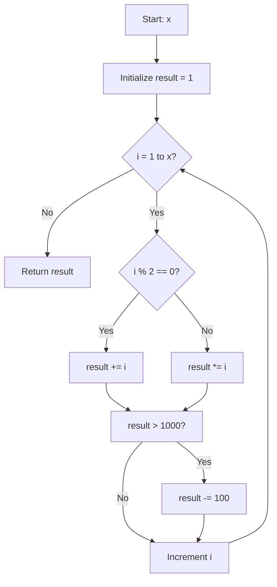
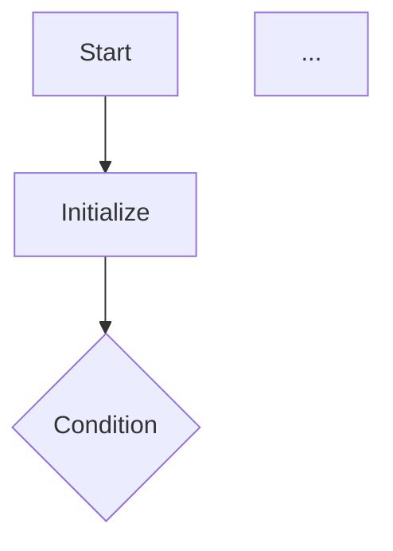

# PP9

## Goal

In this exercise you will:

* Practice using **control structures** (`for`, `if/else`, `switch`) by implementing subprograms.
* Break algorithms into modular C files and design functions with input/output contracts.
* Translate a flowchart (in Mermaid syntax) into working C code.

**Important:** Start a stopwatch when you begin and work uninterruptedly for **90 minutes**. When time is up, stop immediately and record where you paused.

---

## Workflow

1. **Fork** this repository on GitHub.
2. **Clone** your fork locally.
3. Create a `solutions/` directory at the project root:

   ```bash
   mkdir solutions
   ```
4. For each task, add the specified C source files under `solutions/`.
5. **Commit** your changes locally and **push** to GitHub.
6. **Submit** your GitHub repo link for review.

---

## Prerequisites

* GNU C compiler (`gcc`).
* Familiarity with C control structures and function declarations.
* Basic understanding of Mermaid flowchart syntax.

---

## Tasks

### Task 1: Control-Structure Subprograms

**Objective:** Implement three separate C programs, each demonstrating a different control structure.

1. **For Loop**

   * Create `solutions/use_for.c`.
   * Write a function `void count_up(int n)` that uses a `for` loop to print numbers from `1` to `n`, separated by spaces, then a newline.
   * In `main()`, call `count_up(10)`.

2. **If/Else**

   * Create `solutions/use_if.c`.
   * Write a function `const char* sign_of(int x)` that returns:

     * `"positive"` if `x > 0`
     * `"zero"` if `x == 0`
     * `"negative"` otherwise.
   * In `main()`, test `sign_of` on a few values and print the results.

3. **Switch/Case**

   * Create `solutions/use_switch.c`.
   * Write a function `const char* weekday(int d)` mapping `1–7` to day names (`"Monday"`–`"Sunday"`), using a `switch` statement.
   * In `main()`, loop `d` from `1` to `7` and print `weekday(d)`.

**Compile & run each:**

```bash
cc -o solutions/use_for    solutions/use_for.c
cc -o solutions/use_if     solutions/use_if.c
cc -o solutions/use_switch solutions/use_switch.c
./solutions/use_for
./solutions/use_if
./solutions/use_switch
```

---

### Task 2: Flowchart Implementation (Mermaid Diagram)

**Objective:** Translate the following Mermaid flowchart into working C function in its own file.



1. Create `solutions/flowchart_impl.c`.
2. Get an integer `x` passed by value.
3. Implement algorithm as shown:

   * Initialize `result = 1`.
   * Loop `i` from `1` to `x`:

     * If `i` even, add `i`; else multiply.
     * If `result > 1000`, subtract `100`.
   * Print `result`.
4. Compile:

```bash
gcc -c solutions/flowchart_impl solutions/flowchart_impl.c
```
5. Now write a `flowchart_impl.h`, and a `main.c` that calls the function. 

Reflection:

* **Explain how each flowchart node maps to your C code.**

Funktionsdeklaration mit Rückgabewert x Schritt 1
variable result definieren und auf 1 setzen Schritt 2 
for Schleife von 1 - x Schritt 3 
Wenn in for Schleife Abfrage if Schritt 4 
Wenn erfüllt result += i Schritt 5.1
ansonsten result*= i Schritt 5.2
neue if Abfrage result >1000 Schritt 6 
wenn erfüllt result -= 100 Schritt 7 

---

### Task 3: Code-to-Flowchart

**Objective:** Examine two provided C functions and draw their flowcharts in Mermaid.

1. **Function 1:** `transform_complex(int x)` in `solutions/algorithm_one.c`:

   ```c
   int transform_complex(int x) {
       int result = 1;
       for (int i = 1; i <= x; i++) {
           if (i % 2 == 0) result += i;
           else             result *= i;
           if (result > 1000) result -= 100;
       }
       return result;
   }
   ```
2. **Function 2:** `evaluate_sequence(int *arr, int len)` in `solutions/algorithm_two.c`:

   ```c
   bool evaluate_sequence(int *arr, int len) {
       int state = 0;
       for (int i = 0; i < len; i++) {
           if (arr[i] < 0)       state = -1;
           else if (arr[i] == 0) state = 0;
           else                  state = 1;
           if (state == 1) break;
       }
       switch (state) {
           case 1: return true;
           default: return false;
       }
   }
   ```
3. For each function, draw a **Mermaid** flowchart capturing loops, branches, and switch logic. Include your Mermaid code in a Markdown file under `solutions/`.

**Example Skeleton:**



---

**Remember:** Stop after **90 minutes** and record where you stopped.
